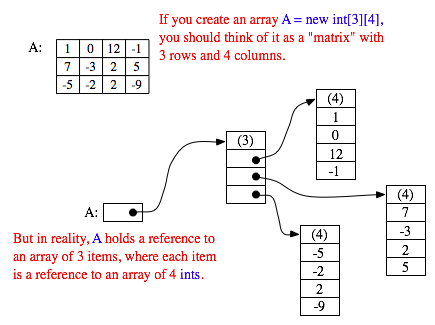
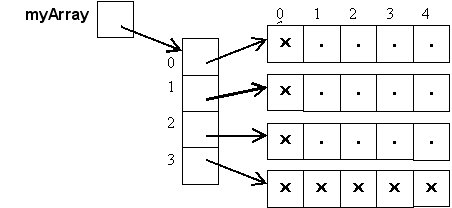

### Увод

- Низови су група сличних вредности којима приступамо преко заједничког имена
    - сличних - Исти тип променљиве (int, String, ... , НекаКласа)
- Елементи низа су ПОРЕЂАНИ
- Индексирање (позиционирање) почиње од нуле
- Последњи елемент низа је N-1 где је N дужина низа (јако важно)

----------------------------------------------------------
### Декларација и дефиниција низа

- Приликом дефинисања низа, морамо да доделимо број елемената (size/length)
    - `arr = new T[size];` 
        - T  је тип (int, String, ...)
        - size је величина низа
- Шта ако нам је потребан већи низ касније?
    - Креирамо нови низ који је већи, и копирамо остале елементе на почетне позиције

----------------------------------------------------------
### Инстанцирање низа, подразумеване вредности

- Елементи низа који се креирају са `new` ће увек бити постављени на подразумеване вредности
    - int - 0
    - bool - false
    - null - Сви референтни типови
- Можемо поставити вредности низа приликом иницијализације (Корисно за брз тест)
    - `int[] intArray = new int[]{ 1,2,3,4,5,6,7,8,9,10 };`
    - Аутоматски одређена дужина (биће тачно колико треба)

----------------------------------------------------------
### Приступање елементима низа, и проблеми

- Елементима се приступа са `arr[i]` где је arr низ, а i је позиција елемента низа који тражимо (водити рачуна, почиње од 0, и иде до N-1)

- Шта ако покушамо да приступимо елементу који не спада у интервал 0 - N-1?
    - `ArrayIndexOutOfBoundsException`
    - Јако честа грешка када користимо петље и низове
    - Водити рачуна о граничним вредностима

----------------------------------------------------------
### Предности коришћења низова (корисније ће бити касније)

- Оптимизација кода (сортирање и дохватања података брзо)
- Насумичан приступ (Random Access) - Можемо да дохватимо било који елемент одмах, без пролажења кроз низ (ако знамо његову позицију)

----------------------------------------------------------
### Мане

- Лимитирање величине - Морамо да се довијамо ако желимо да "проширимо" низ
- Низови се у меморији чувају редом, тако да није препоручљиво имати огромне низове
    - Нпр ако имамо низ од 1024 integer-a, то заузима 4 килобајта
    - Замислите већи број низова који раде међусобно, који су 1000 пута већи (4мегабајта),тј имају милионе елемената (не тако ретка ситуација у стварности)

----------------------------------------------------------

### Илустрацијe


- Обратите пажњу на то када кажемо нпр `arr = new double[10]`, променљива arr заправо није низ
    - arr је само РЕФЕРЕНЦА на низ, који се налази на другом месту (као што је илустровано изнад)
    - Ово ће бити нарочито важно када будемо радили методе (функције), и када будемо прослеђивали низове њима

<div style="page-break-after: always;"></div>
----------------------------------------------------------

### Итерација и чести примери

```java
// Испиши сваки елемент низа
int[] arr = {1, 7, 3, 11, 15, 13}; // Може и без new int[] (новије верзије Јаве)

for(int i = 0; i < arr.length; i++){
    System.out.println(arr[i]); // Исписивање сваког елемента низа
}
```

```java
// Испиши сваки непаран елемент низа
int[] arr = {1, 7, 3, 11, 15, 13};

for(int i = 0; i < arr.length; i++){
    if(arr[i] % 2 != 0){
        System.out.println(arr[i]);
    }
}
```

```java
// Нађи најмањи елемент
int[] arr = {1, 7, 3, 11, -15, 13}; 
int min = arr[0]; // Стављамо било који елемент низа као претпоставку

for(int i = 0; i < arr.length; i++){
    if(arr[i] < min){ // Ако је неки мањи, замени тренутно најмањи њиме
        min = arr[i];
    }
}

System.out.println(min); 
```

```java
// Квадрирај сваки елемент низа
int[] arr = {1, 7, 3, 11, 15, 13};

for(int i = 0; i < arr.length; i++){
    arr[i] = arr[i] * arr[i];
}
```

```java
// Извући у други низ све парне бројеве
int[] arr = {1, 7, 4, 11, 15, 18, 22, 17, 21, 14};

// Не знамо колико ће бити елемената укупно
// Тако да правимо места онолико колико има елемената у првом низу (можда су сви парни)
int[] temp = new int[arr.length]; // биће напуњен нулама

// Индекс уписаног парног броја (и уједно бројач парних бројева)
int num = 0; 

for(int i = 0; i < arr.length; i++){
    if(arr[i] % 2 == 0){
        temp[num] = arr[i]; // Смештамо паран број на први слободан индекс новог низа
        num++; // Померамо индекс искључиво ако смо нашли паран
    }
}

// Сада имамо следећу ситуацију:
// arr  -> [1, 7, 4, 11, 15, 18, 22, 17, 21, 14]
// temp -> [4, 18, 22, 14, 0, 0, 0, 0, 0, 0]
// Желимо низ који има само [4, 18, 22, 14]
// num је ишао од 0, и повећавао се за 1 сваки пут кад је наишао на паран број
// Завршна вредност num је 4, а то је уједно и жељена величина низа парних бројева

int[] evens = new int[num];
for(int i = 0; i < evens.length; i++){
    evens[i] = temp[i]; // Смештамо сваки елемент из помоћног низа
}
```

- Напомена: Додајте корисне честе ствари овде

<div style="page-break-after: always;"></div>

----------------------------------------------------------



----------------------------------------------------------




- Можемо правити и вишедимензионе низове (приказ дводимензионог изнад)
- Пример: `arr = new int[4][5]`
    - Видети слику изнад
    - Ово значи да постоји референца која садржи 4 референце
    - А те 4 референце, свака показује на низ са 5 елемената
    - Најчешће ово посматрамо као 4x5 матрицу или табелу
        - Први број (4) - Означава број редова
        - Други број (5) - Означава број колона у сваком реду
    - Елементима приступамо слично 1-димензионом, прво наводимо индекс реда, па колоне
        - Нпр ако хоћемо да приступимо елементу који се налази у другом реду и првој колони `arr[2][1]`
    - За овакве низове су честе двоструке петље
----------------------------------------------------------

